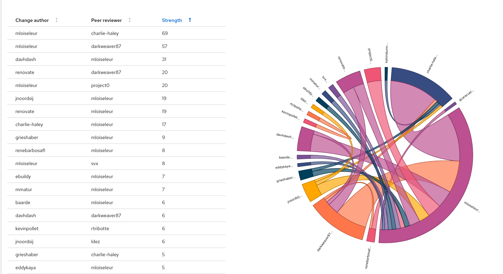
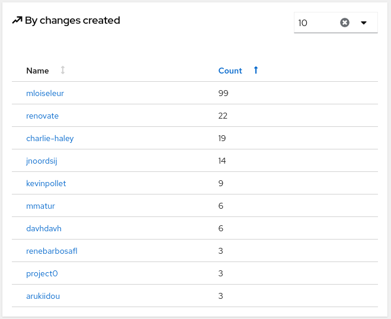
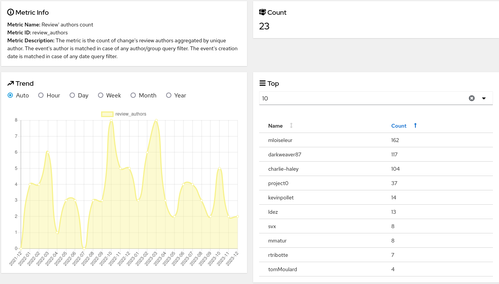

# Contributing Guide

This Helm Chart accepts contributions from GitHub pull requests.
You can find help in this document to get your contribution accepted.

## Helm Chart Guidelines

Please read the [Helm Chart Guidelines](./traefik/Guidelines.md) before editing this chart.

## Testing

Please read the [testing guidelines](./TESTING.md) to learn how testing is done with this chart.

## Guidelines

According to the Traefik HelmChart [philosophy](./README.md#philosophy),
the guidelines for future evolutions are:

* fix bugs
* improve security
* improve HelmChart support
* improve Kubernetes features support
* improve Traefik default configuration

While encouraging contributions, the philosophy leads to avoid introducing:

* specific use cases
* third party CRD
* dashboard exposition tuning
* helm chart variables that shortcuts/expose static or dynamic Traefik configuration

# Statistics

Once a year, [monocle](https://github.com/change-metrics/monocle) is used to gather statistics on this project.

They were gathered with this config file:

```yaml
---
workspaces:
  - name: monocle
    crawlers:
      - name: github-traefik
        provider:
          github_organization: traefik
          github_repositories:
            - traefik-helm-chart
        update_since: '2022-01-01'
```

## Peers strength



## PRs opened



## Reviewed PRs




